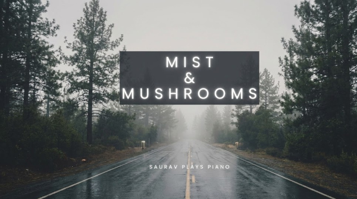

## The Concept

*Mist & Mushrooms* is a cinematic study of stillness and organic growth. Inspired by the quiet, foggy mornings in the Pacific Northwest, this piece focuses on the "felted" textures of the piano and the space between the notes.

## Technical Breakdown

To capture the specific mood of the Oregon woods, I combined my classical roots with a modern digital workflow:

- **Performance:** Recorded via MIDI on a **Kawai Novus NV10**.
- **Sound Design:** The primary voice is **Pianoteq**, using a felted preset on the **Bösendorfer** model to create a soft, intimate attack.
- **Atmosphere:** Layered with gentle strings and ambient textures inside **Reaper**.

## Status

Out January 16th on Spotify, Apple Music, YouTube Music, Amazon Music, and other streaming platforms. Pre-save to your playlist [here](https://ffm.to/mistandmushrooms).

<!--

  <iframe 
    src="https://www.youtube.com/embed/_jZoaN76BVk" 
    style="width: 100%; height: 100%;"
    title="Mist & Mushrooms Preview" 
    frameborder="0" 
    allow="accelerometer; autoplay; clipboard-write; encrypted-media; gyroscope; picture-in-picture; web-share" 
    referrerpolicy="strict-origin-when-cross-origin" 
    allowfullscreen>
  </iframe>

-->
